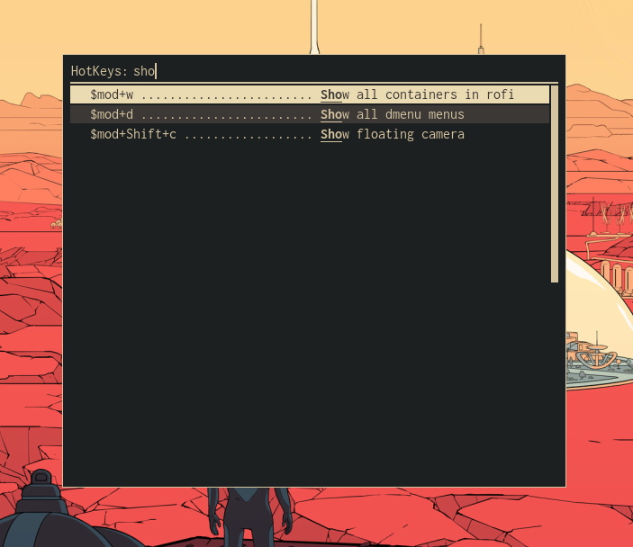

dmenu-hotkeys
=============
[](https://pypi.python.org/pypi/dmenu_hotkeys)
[](https://travis-ci.org/maledorak/dmenu-hotkeys)
[](https://codecov.io/gh/maledorak/dmenu-hotkeys)
[](https://dmenu-hotkeys.readthedocs.io/en/latest/?badge=latest)

Your hotkeys for various apps in 'dmenu' style.

Features
--------
This app allows you to prepare cheat sheet of hotkeys from your apps in simple menu with search.



Supported
---------

### Menus
* [dmenu](https://tools.suckless.org/dmenu/)
* [rofi](https://github.com/davatorium/rofi)

### Apps
* [i3](https://i3wm.org/)
* [openbox](http://openbox.org/wiki/Main_Page)


Requirements
------------
This app needs below apps as a GUI, so install one of these first.
* dmenu
* rofi

Install
-------

### From pip
This app works on Python 2.7, 3.4, 3.5, 3.6, 3.7, so the best choice is installation using pip

```
pip install --user dmenu-hotkeys
```

then you could run it by typing in console

```
dmenu_hotkeys
```

### From git repo
Clone repository
```
git clone git@github.com:maledorak/dmenu-hotkeys.git .
```

and run script in bin dir like this
```
./dmenu-hotkeys/bin/dmenu_hotkeys
```


How to use
----------

### Run menu with hotkeys
1. Add the following comment line before hotkey line which you want to use in your app config file.

    eg:

    * i3: `# %%hotkey: Some description of the following hotkey %%`
    * openbox: `<-- %%hotkey: Some description of the following hotkey %% -->`
    
    Notice: For full configuration file examples check [test/fixtures](./tests/fixtures) directory

2. Run the dmenu-hotkeys
    ```
    dmenu_hotkeys run --menu [dmenu|rofi] --app [i3|openbox]
    ```
    
3. Check help if you want to know more
    ```
    dmenu_hotkeys run --help
    ```
    
### Override dmenu-hotkeys configuration file
If you want to change default configuration paths for apps (i3, openbox, etc) 
you should override dmenu-hotkeys config file.

```
dmenu_hotkeys copy-config
```

The default path for the overridden configuration file is
```
$HOME/.config/dmenu_hotkeys/config.cfg
```

You could change it
```
dmenu_hotkeys copy-config --dest some/path/config.cfg
```


But since then you always should run dmenu-hotkeys with this new path

```
dmenu_hotkeys run --menu [dmenu|rofi] --app [i3|openbox] --config-path some/path/config.cfg
```
