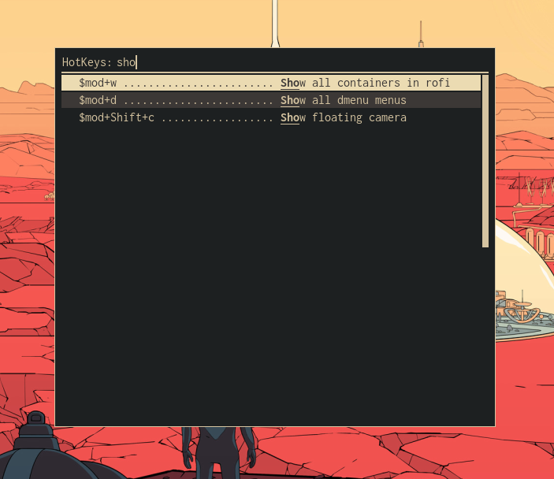

=============
dmenu-hotkeys
=============

.. image:: https://img.shields.io/pypi/v/dmenu_hotkeys.svg
        :target: https://pypi.python.org/pypi/dmenu_hotkeys

.. image:: https://img.shields.io/travis/maledorak/dmenu_hotkeys.svg
        :target: https://travis-ci.org/maledorak/dmenu_hotkeys

.. image:: https://readthedocs.org/projects/dmenu-hotkeys/badge/?version=latest
        :target: https://dmenu-hotkeys.readthedocs.io/en/latest/?badge=latest
        :alt: Documentation Status

Your hotkeys for various apps in 'dmenu' style.

Features
--------
This app allows you to prepare cheat sheet of hotkeys from your apps in simple menu with search.

Supported apps
--------------
* i3
* openbox

Requirements and Install
------------------------
1. This app works on :code:`dmenu` or :code:`rofi` as GUI, so install one of these two first.
2. Install: :code:`pip install dmenu-hotkeys`

How to use
----------
1. Add the following comment line before hotkey line which you want to use in your app config file.

eg:

* i3: :code:`# %%hotkey: Some description of the following hotkey %%`
* openbox: :code:`<-- %%hotkey: Some description of the following hotkey %% -->`

2. Run the dmenu-hotkeys via: :code:`dmenu_hotkeys --menu [dmenu|rofi] --app [i3|openbox]`

TODO
----
* Checking if the user has dmenu/rofi installed
* More supported apps
* User configuration overriding
* Tests

Credits
-------

This package was created with Cookiecutter_ and the `audreyr/cookiecutter-pypackage`_ project template.

.. _Cookiecutter: https://github.com/audreyr/cookiecutter
.. _`audreyr/cookiecutter-pypackage`: https://github.com/audreyr/cookiecutter-pypackage

* Free software: MIT license
* Documentation: https://dmenu-hotkeys.readthedocs.io.
